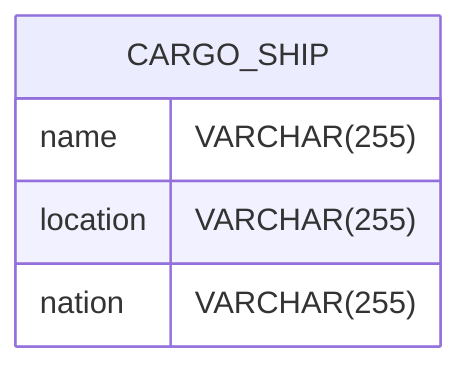

## Repository
https://github.com/Guybrush3791/boolean-uk-1-fortnox-webflux-flux.git

## Learning Objectives

- *Reactive* programming
- *WebFlux*
- `Flux<T>` class and it's use in *Reactive programming* context
- Exception handling

## Instructions

1. Fork this repository
2. Clone your fork to your machine
3. Open the project in *IntelliJ*
4. Copy `application.yaml.example` to `application.yml` and fill out your *database* and *security* connection details
5. Check that `build.gradle` contains the correct dependencies and rerun gradle sync to make it all update

## Activity

### Core
You have a very simplified **international shipment app** with following database

Once you created basic classes like JPA entity, DTO, repository and service, support following capabilities:
- CRUD on `CargoShip`
- subscription through `Flux` to get ship update each time *location* or *nation* change

Add support for error handling in following cases:
- **cargo ship not found** --> get back with error and close communication
- **cargo ship on empty location** --> get back with error until problem is solved (location is not empty anymore)
- **cargo ship is in nation `uknown`** --> don't say nothing to client, but log the event